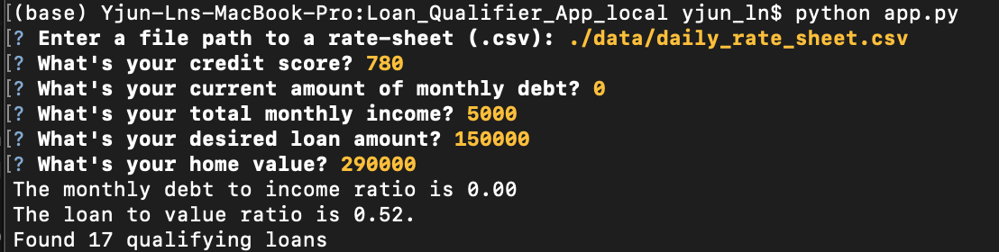
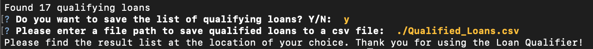

# Loan Qualifier App

>This App is designed to be mainly used by loan institutions and their customers to quickly narrow down a list of potential banks that would approve their loan applications based on customer's **credit score**, **current debt**, **monthly income**, **loan amount**, and their **current home value**.
---

## Technologies
This project leverages python 3.7 with the following packages:

* [fire](https://github.com/google/python-fire) - For the command line interface, help page, and entry-point.

* [questionary](https://github.com/tmbo/questionary) - For interactive user prompts and dialogs

* [pathlib](https://docs.python.org/3/library/pathlib.html) - For providing paths of files and directories

---

## Installation Guide

Before running the application, first, install the following dependencies in Terminal or Bash.

```python
  pip install fire
  pip install questionary
  pip install pathlib
```

---

## Usage

To use the Loan Qualifier application, users will conduct a series of **CLI** (Command Line Interface) interactions. Simply clone the repositor. Open Terminal or Bash and use `cd` to change directory to where the **app.py** file is located. Then type

```python
python app.py
```
to launch the app. Users will need to answer a flow of questions, from providing the path of bank data sheet to customers' financial information, such as shown below. 



Upon finishing, users will get a result of their **DTI** (monthly debt to income) ratio, **LTV** (loan to value) ratio, and a number of qualifying loans. Then, users will have the option to save the result list of qualifying banks to a place as they desire in a CSV formated file.



If there is not any qualifying bank or users choose not to save the result list, they will be exited out of the application.

---

## Contributors

**UC Berkeley Extension**

**Yanjun Lin Andrie**

* yanjun.lin.andrie@gmail.com

* https://www.linkedin.com/in/yanjun-linked

---

## License

MIT
